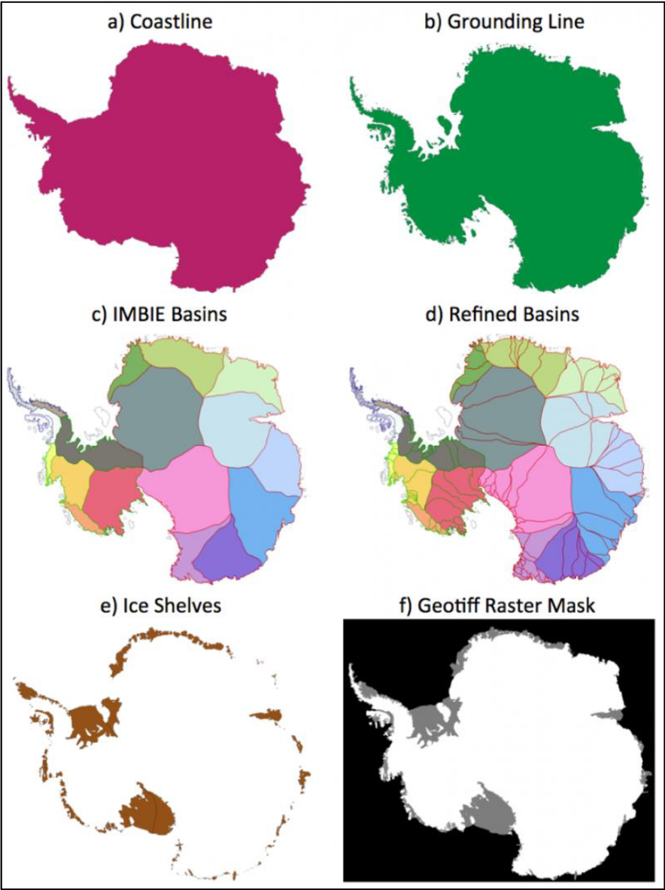

# Antarctic boundaries

A complete MEaSUREs grounding line, coast line, and mask dataset from Mouginot et al. 2017.

# Requirements 
You'll need [Antarctic Mapping Tools for MATLAB](https://github.com/chadagreene/Antarctic-Mapping-Tools).

# Documentation 
To view documentation online, click on the [Examples tab on the File Exchange page here](https://www.mathworks.com/matlabcentral/fileexchange/60246).

To view documentation from within Matlab, simply type `amt` followed by the fuction name into the Command Window. For example, to view the documentation for the `isiceshelf` fuction, type 

    amt isiceshelf

# Contents 
### Data Loading
This toolbox contains all the data you need, but you read about the data, so there's no need to download any data, but you can read about the data [here](https://nsidc.org/data/NSIDC-0709) if you would like. These functions make it easy to import the grounding lines, coast lines, ice shelf outlines, and ice basins into Matlab:

**`antbounds_data`** lets you easily load grounding line, coast, or ice shelf outline data. The grounding line in this dataset is obtained by the same InSAR methods which were used for the `measures_data` grounding line; however, `antbounds_data` is continuous around the continent and represents only a single snapshot in time (2008), whereas `measures_data` is discontinous and lets you see grounding line evolution through time.
    
**`basin_data`** loads IMBIE or IMBIE Refined basins.

### Interpolation and masking functions
This toolbox contains five functions which are optimized to load Mouginot et al.'s Mask\_Antarctica data and and interpolate to determine whether locations correspond to grounded ice, ice shelves, open ocean, etc. The `inbasin` function works the same way, and is convenient for limiting your dataset to contain only values within a given ice basin. In my work, I've found these functions and `dist2mask` have become absolutely invaluable. I hope they're just as helpful for you.

**`isgrounded`** determines whether input coordinates correspond to grounded ice.

**`isiceshelf`** determines whether input coordinates correspond to ice shelf.

**`isopenocean`** determines whether input coordinates correspond to open ocean (no grounded ice, and no ice shelves, but sea ice is considered open ocean).

**`isice`** determines whether input coordinates correspond to any part of the ice sheet, grounded ice or ice shelves. This is the logical NOT of isopenocean.

**`istidal`** determines whether input coordinates are seaward of the landward limit of flexure as measured by InSAR. This is the logical NOT of isgrounded.

**`inbasin`** determines which input coordinates are within a given ice basin.

**`dist2mask`** calculates the distance from any point(s) to the nearest mask type. This can be useful if you want to plot data as a function of distance from the grounding line, or if you have a bunch of mooring data, and you only want to consider the moorings that were collected within some number of kilometers of an ice shelf front. 

### Data plotting
These functions make plotting pretty easy:

**`antbounds`** simply plots the line data given by `antbounds_data`.

**`labelshelves`** simply labels the ice shelves plotted by the `antbounds` function.

**`plot_basins`** plots IMBIE or IMBIE Refined ice drainage basin boundaries.

# Citing this data 
If this dataset and these tools are useful for you, please cite the following: 

Mouginot, J., B. Scheuchl, and E. Rignot. 2017. MEaSUREs Antarctic Boundaries for IPY 2007-2009 from 
Satellite Radar, Version 2. [Indicate subset used]. Boulder, Colorado USA. NASA National Snow and Ice 
Data Center Distributed Active Archive Center. [https://dx.doi.org/10.5067/AXE4121732AD](https://dx.doi.org/10.5067/AXE4121732AD). 

Rignot, E., S. S. Jacobs, J. Mouginot, and B. Scheuchl. 2013. Ice-shelf melting around Antarctica, 
Science. 341. 266-270. [http://dx.doi.org/10.1126/science.1235798](http://dx.doi.org/10.1126/science.1235798). 

Greene, C. A., Gwyther, D. E., & Blankenship, D. D. Antarctic Mapping Tools for Matlab. 
Computers & Geosciences. 104 (2017) pp.151-157. [https://dx.doi.org/10.1016/j.cageo.2016.08.003](https://dx.doi.org/10.1016/j.cageo.2016.08.003)
